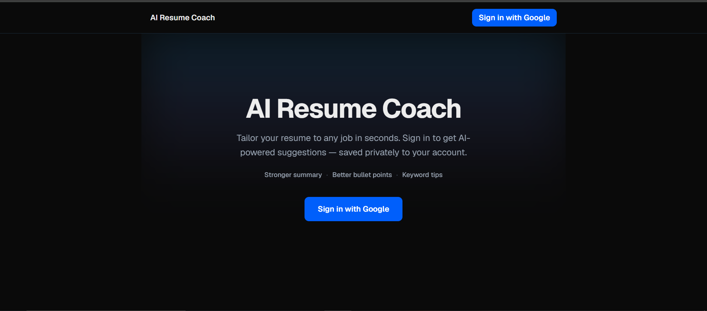
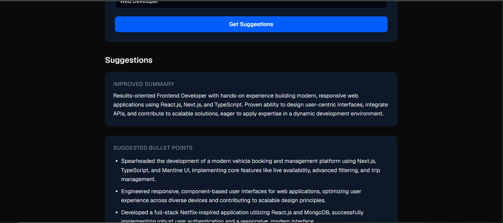
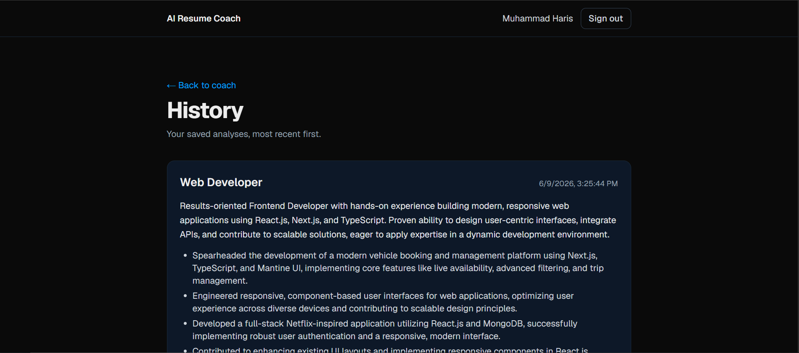

# AI Resume Coach

> Paste or upload your resume, name a target job, and get AI-powered suggestions — a stronger summary, sharper bullet points, and keywords to match the role.


---

## Overview

Tailoring a resume to each job is tedious, and most people aren't sure *what* to change. **AI Resume Coach** does it in seconds: a job seeker provides their resume (pasted text or a PDF upload) and a target job title, and the app uses Google's Gemini model to return concrete, role-specific improvements — a rewritten professional summary, stronger bullet points, and a set of keywords to help with applicant-tracking systems (ATS) and recruiters.

Every analysis is **saved privately to the signed-in user's account**, so they can revisit past results.

This started as a frontend project and grew into a complete full-stack application: authentication, a database, server-side AI calls, file parsing, and a production deployment.

## Live Demo

**▶ [ai-resume-coach-lovat.vercel.app](https://ai-resume-coach-lovat.vercel.app)**

> Sign-in uses Google OAuth. (The Google consent screen is in test mode, so live sign-in is limited to approved test accounts.)

### Screenshots

<!--
  Add your images, then update the paths below.
  1. Create a folder named `screenshots/` in the project root.
  2. Drop your PNG/JPG files in it (e.g. landing.png, results.png, history.png).
  3. Reference them with relative paths, exactly like the lines below.
-->

| Landing | Suggestions | History |
| --- | --- | --- |
|  |  |  |

## Key Features

- **🔐 Google sign-in** — authentication via Auth.js (NextAuth v5) with database-backed sessions.
- **📝 Two ways to input a resume** — paste plain text, or upload a **PDF** (text extracted server-side).
- **🤖 AI suggestions** — Gemini returns a stronger **summary**, improved **bullet points**, and recommended **keywords** for the target role, as structured JSON.
- **🗂️ Per-user history** — every analysis is saved and listed (most recent first) for the logged-in user only.
- **🔒 Real authorization** — the API enforces login server-side and scopes all data by user ID (not just hidden UI).
- **📱 Responsive, themed UI** — clean Tailwind design with light/dark support, plus loading and error states.

## Tech Stack

| Layer | Technology |
| --- | --- |
| Framework | **Next.js 16** (App Router, Server Components, Route Handlers) |
| Language | **TypeScript** |
| Styling | **Tailwind CSS v4** |
| Auth | **Auth.js (NextAuth v5)** — Google OAuth, database sessions |
| Database / ORM | **Neon** (serverless PostgreSQL) via **Prisma** |
| AI | **Google Gemini** (`gemini-2.5-flash`) over the REST API |
| PDF parsing | **unpdf** (pure-JS, serverless-friendly) |
| Hosting | **Vercel** |

## How It Works

```
Browser (Client Component: the resume form)
   │  POST /api/suggest  (multipart form: jobTitle + pasted text and/or PDF)
   ▼
API Route Handler (server, Node runtime)
   │  1. auth() — reject if not signed in (401)
   │  2. If a PDF was sent → extract its text with unpdf
   │  3. Build a prompt and call the Gemini REST API (API key stays server-side)
   │  4. Parse Gemini's JSON → { summary, bullets[], keywords[] }
   │  5. Save the result to Postgres via Prisma, tagged with the user's id
   ▼
Response: JSON suggestions → rendered in the UI

History page (Server Component)
   └─ reads the database directly, filtered to the logged-in user's records
```

Key design points:
- **Secrets never reach the browser** — the Gemini API key and all database access live only in server code.
- **Data ownership is enforced on the server** — the user id comes from the trusted session, and every read/write is filtered by it.
- **The PDF parser is loaded lazily** inside the handler so it never runs at cold-start, keeping the function reliable on serverless.

## Running Locally

### Prerequisites
- Node.js 20+
- A **Neon** PostgreSQL database (free tier)
- A **Google Cloud OAuth** client (Web application)
- A **Google Gemini** API key

### Steps

```bash
# 1. Clone and install
git clone https://github.com/MuhammadHarisBaloch/ai-resume-coach.git
cd ai-resume-coach
npm install

# 2. Create a .env.local file in the project root (see variables below)

# 3. Apply the database schema to your Neon database
npm run db:migrate

# 4. Start the dev server
npm run dev
# open http://localhost:3001
```

### Environment variables

Create a **`.env.local`** file in the project root (it's git-ignored — never commit it):

| Variable | Description |
| --- | --- |
| `GEMINI_API_KEY` | Google Gemini API key (used for AI suggestions). |
| `DATABASE_URL` | Neon **pooled** connection string — used by the app at runtime. |
| `DIRECT_URL` | Neon **direct** (non-pooled) connection string — used by Prisma migrations. |
| `AUTH_SECRET` | Secret that signs/encrypts the session cookie. Generate one with `npx auth secret`. |
| `AUTH_GOOGLE_ID` | Google OAuth client ID. |
| `AUTH_GOOGLE_SECRET` | Google OAuth client secret. |
| `AUTH_URL` | *(Optional locally)* e.g. `http://localhost:3001`. Not required — the app enables `trustHost`. |

> In Google Cloud Console, add `http://localhost:3001/api/auth/callback/google` as an authorized redirect URI for local sign-in (and your production URL for the deployed app).

### Useful scripts

```bash
npm run dev          # start the dev server (http://localhost:3001)
npm run build        # production build
npm run db:migrate   # run Prisma migrations against your database
npm run db:studio    # open Prisma Studio to browse the database
```

## What I Learned / What I'd Build Next

This project was my path from **frontend developer to full-stack**. I began with a static UI and incrementally added a backend API route, a real AI integration, a PostgreSQL database with Prisma, Google authentication with per-user data ownership, and a production deployment — debugging real-world issues along the way (serverless vs. local differences, OAuth redirect URIs, native-dependency pitfalls in serverless, and not leaking internal error details to clients).

**Next steps I'd explore:**
- **Job-description matching (RAG):** paste a full job posting and tailor suggestions against it by retrieving the most relevant resume sections.
- **Rate limiting & quotas:** protect the AI endpoint from abuse and manage cost.
- **Editable history:** rename, delete, or compare past analyses; export to PDF/Markdown.
- **More input formats:** DOCX support and drag-and-drop uploads.
- **Streaming responses:** stream the AI output token-by-token for a faster feel.
- **Automated tests & CI:** unit/integration tests and a continuous-integration pipeline.

---

Built by **Muhammad Haris**.
